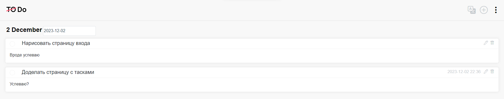

# Vue.js Todo App

## Build Setup

Clone the repository and run the following commands:

```bash
# install dependencies
npm install

# serve with hot reload at localhost:1234
npm run dev
node .\server\server.js

# build for production with minification
npm run build
node .\server\server.js
```

## ERD


## Some screenshots





